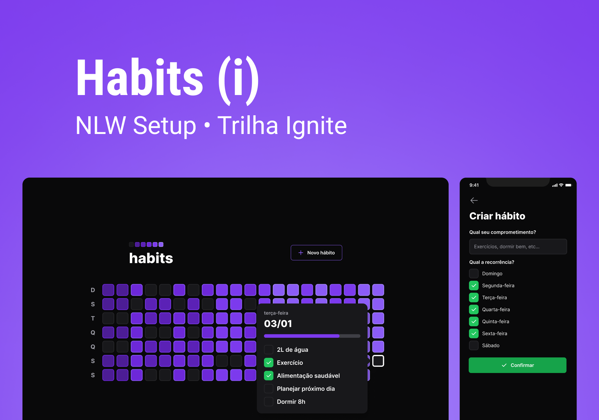

<h1 align="center">
  
</h1>

<br/>



<br/>

<h1 align="center">Habits</h1>
<p align="center">uma ferramenta de acompanhamento de hábitos para o usuário colocar em prática suas resoluções e metas.</p>

<br/>

<p align="center">
  
  
  
  
  <a href="https://github.com/ivopereira-jr/Next-Level-Week-Setup/commits/master">
    
  </a>
  
  
</p>

<br/>

<h2 align="center"> 
	🚧  Habits 🚀 Em construção...  🚧
</h2>

<br/>

## Tabela de conteúdos

<!-- vscode-markdown-toc -->

- [Sobre](#sobre-o-projeto)
- [Layout](#layout)
- [Tecnologias](#tecnologias)
- [Requisitos](#pre-requisitos)
- [Licença](#licença)

<!-- vscode-markdown-toc -->

<br/>

## <a name='sobre-o-projeto'></a> 👨🏻‍💻 Sobre o projeto

A Next Level Week Setup esta na 11º edição desse evento oferecido pela [Rocketseat](https://rocketseat.com.br) para a comunidade. Nessa edição, na trilha Ignite, vamos desenvolver um projeto de controle de hábitos habit tracker, uma ferramenta de acompanhamento de hábitos para o usuário colocar em prática suas resoluções e metas, ou seja, registrar ações e acompanhar a evolução dos novos hábitos que deseja colocar na sua rotina.

<br/>

## 🚀 Próximo nível

- [ ] Autenticação
- [ ] Notificações
- [ ] Perfil público com resumo dos hábitos completados

<br/>

## <a name='layout'></a> 🔖 Layout

Você pode visualizar o layout do projeto através do link abaixo:

- [Habits - Figma](https://www.figma.com/community/file/1195326661124171197)

Lembrando que você precisa ter uma conta para acessá-lo [Figma](http://figma.com/).

<br/>

## <a name='tecnologias'></a> 🛠️ Tecnologias

As seguintes ferramentas foram usadas na construção do projeto:

- [Node.js](https://nodejs.org/en/)
- [Fastify](https://www.fastify.io/)
- [Prisma](https://www.prisma.io/)
- [Vitejs](https://vitejs.dev/)
- [ReactJS](https://reactjs.org/)
- [TypeScript](https://www.typescriptlang.org/)
- [Tailwind CSS](https://tailwindcss.com/)
- [Expo](https://expo.io/)
- [React Native](https://reactnative.dev/)
- [NativeWind](https://www.nativewind.dev/)

<br/>

## <a name='pre-requisitos'></a> 💻 Pré-requisitos

Antes de começar, você vai precisar ter instalado em sua máquina as seguintes ferramentas:
[Git](https://git-scm.com), [Node.js](https://nodejs.org/en/).
Além disto é bom ter um editor para trabalhar com o código como [VSCode](https://code.visualstudio.com/)

<br/>

## 🎲 Rodando o Back End (servidor)

<br/>

```bash
#Siga os passos abaixo

# Clone este repositório
$ git clone https://github.com/ivopereira-jr/Next-Level-Week-Setup.git

# A partir da pasta raiz do projeto, vá para a pasta server
$ cd server

# Instale as dependências
$ npm i
# ou
$ yarn

# execute a aplicação
$ npm run dev
# ou
$ yarn dev

# Muito bem, o projeto vai ser iniciado em.
http://localhost:3333

```

## 🖥️ Rodando o Front-End (web)

_Obs.: Antes de continuar, certifique-se de ter a API em execução_

```bash
# A partir da pasta raiz do projeto, vá para a pasta web
$ cd web

# Instale as dependências
$ npm i
# ou
$ yarn

# execute a aplicação
$ npm run dev
# ou
$ yarn dev

# Muito bem, o projeto vai ser iniciado em.
http://localhost:5173

```

## 📱 Mobile

_Obs.: Antes de continuar, certifique-se de ter a API em execução_

```bash
# A partir da pasta raiz do projeto, vá para a pasta mobile
$ cd mobile

# Instale as dependências
$ npm i
# ou
$ yarn

# Iniciar o app
$ npm start
# ou
$ yarn start


# Se você vai emular com android, execute este comando
# Certifique-se de ter o emulador aberto
$ yarn android

# Se você for emular com ios, execute este comando
$ yarn ios

```

<br/>

## 🤔 Como contribuir

**Faça um fork deste repositório**

```bash
# Fork usando a linha de comando oficial do GitHub
# Se você não tiver a CLI do GitHub, use o site para fazer isso.

$ gh repo fork ivopereira-jr/Next-Level-Week-Setup
```

**Siga os passos abaixo**

```bash
# Clone seu fork
$ git clone your-fork-url && cd NOME_DO_REPO

# Crie uma ramificação com sua feature
$ git checkout -b my-feature

# Faça o commit com suas alterações
$ git commit -m 'feat: My new feature'

# Envie o código para sua filial remota
$ git push origin my-feature

```

Depois que sua solicitação pull for mesclada, você poderá excluir sua ramificação

<br/>

## <a name='licença'></a> 📝 Licença

Este projeto está licenciado sob a Licença MIT - consulte o arquivo [LICENSE](./LICENSE.md) para obter detalhes.

<br/>

Feito com 💜 por Ivo Pereira ✌🏽 [Entre em contato ](https://www.linkedin.com/in/ivopereira-jr/)
